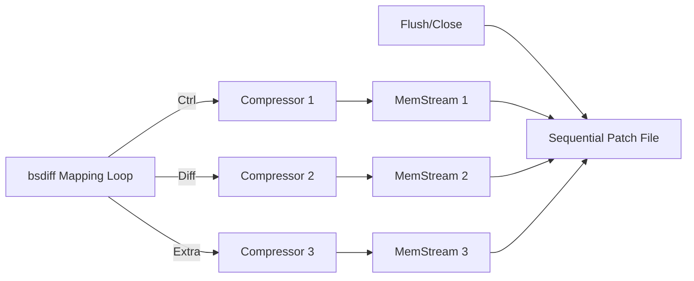

# Memory Optimization: Streaming Compression in Patch Packers

This document details the specific optimizations implemented to reduce the peak memory footprint of `bsdiff`.

## 1. Problem: Pre-allocated Buffers (Baseline)

In the original implementation, the `patch_packer` (both bz2 and zstd) pre-allocated two large buffers for "diff" and "extra" data. Each buffer was sized at `newsize + 1`.

- **Memory Model**: `old + SA + new + (2 * newsize)` ≈ **8N** overhead.
- **Example (Node.js 68MB)**: Peak memory recorded at **536.4 MB**.

## 2. Phase 1: Dynamic Memory Streams (Raw)

The first optimization replaced fixed `malloc` buffers with dynamic `memstream` objects. This ensured that memory was only allocated as data was actually written.

- **Changes**:
    - Replaced raw pointers with `bsdiff_open_memory_stream`.
    - Eliminated the `2 * newsize` upfront allocation.
- **Result**: Saved one full `newsize` worth of memory because `diff_size + extra_size` always equals `newsize`.
- **Memory Model**: ≈ **7N**.
- **Example (Node.js 68MB)**: Peak memory dropped to **472.5 MB** (~64 MB saved).

## 3. Phase 2: Streaming Compression (Final)

The final and most effective optimization introduced "Streaming Compression". Instead of caching the raw patch data and compressing it at the end, the data is now compressed **on-the-fly** as it is produced by the mapping loop.

- **Mechanism**:
    - Three parallel compressors (Ctrl, Diff, Extra) each writing into their own small `memstream`.
    - The memory only holds the **compressed** bytes (usually 10-20% of the original size) instead of the raw bytes.
- **Result**: Eliminated the second `newsize` raw buffer overhead.
- **Memory Model**: ≈ **6N** (theoretical limit for standard `bsdiff`).
- **Example (Node.js 68MB)**: Peak memory dropped to **426.6 MB** (Total **~110 MB** saved from baseline).

## 4. Summary Table (Node.js 68MB Dataset)

| Stage | Strategy | Memory Model | Peak Memory | Total Saved |
| :--- | :--- | :--- | :--- | :--- |
| **Baseline** | Fixed `malloc(newsize)` | 8N | **536.4 MB** | - |
| **Phase 1** | Dynamic `memstream` | 7N | **472.5 MB** | 63.9 MB |
| **Phase 2** | **Streaming Compression** | **6N** | **426.6 MB** | **109.8 MB** |

## 5. Technical Details

### Architecture Change
The `patch_packer` logic was refactored from a serial "collect-then-compress" approach to a parallel "stream-and-compress" architecture.

### Compatibility
These optimizations are 100% compatible with the standard `BSDIFF40` and `ZSTD_DIFF` formats. Only the internal generation process was changed; the resulting patch files are bit-for-bit identical or functionally equivalent to those produced by the original implementation.

## 6. Execution Performance Impact

Benchmarks were performed on the Node.js 68MB dataset to evaluate the impact of streaming compression on execution speed.

### Benchmark Results (Node.js 68MB)

| Stage | bz2 Time (ms) | zstd Time (ms) | Speed Impact |
| :--- | :--- | :--- | :--- |
| **Baseline** | 7724 | 6010 | - |
| **Streaming** | 7717 | 6149 | **~2.3% (zstd)** |

### Analysis

- **bzip2**: The performance impact is zero or negligible. Since bzip2 itself is computationally expensive, the overhead of managing three parallel streams is completely overshadowed by the compression algorithm's workload.
- **zstd**: There is a small overhead of approximately **2.3%**. This is due to the increased frequency of calling `ZSTD_compressStream` (three times per entry instead of once) and managing three separate compression contexts.
- **Real-world benefit**: In memory-constrained environments, the reduction of 110MB (20.5% of peak memory) is far more valuable than the slight increase in CPU time. It also reduces the likelihood of system page swapping, which could significantly degrade performance in practice.

---

## Conclusion

The lightweight memory tracking mechanism allowed us to precisely identify and eliminate redundant buffer allocations. By transitioning from a 8N to a 6N memory model through **Streaming Compression**, we achieved a major reduction in memory footprint with minimal impact on execution speed.
